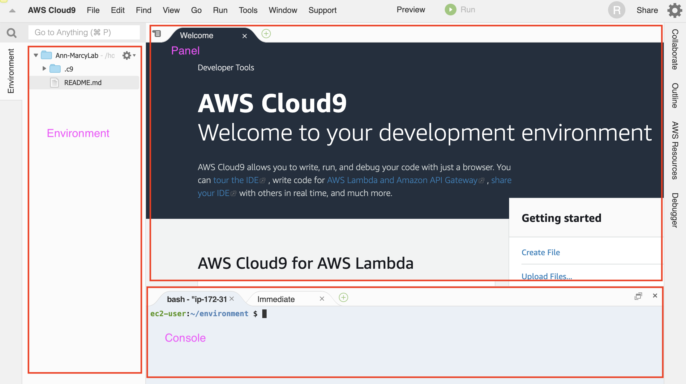
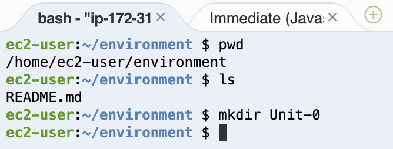
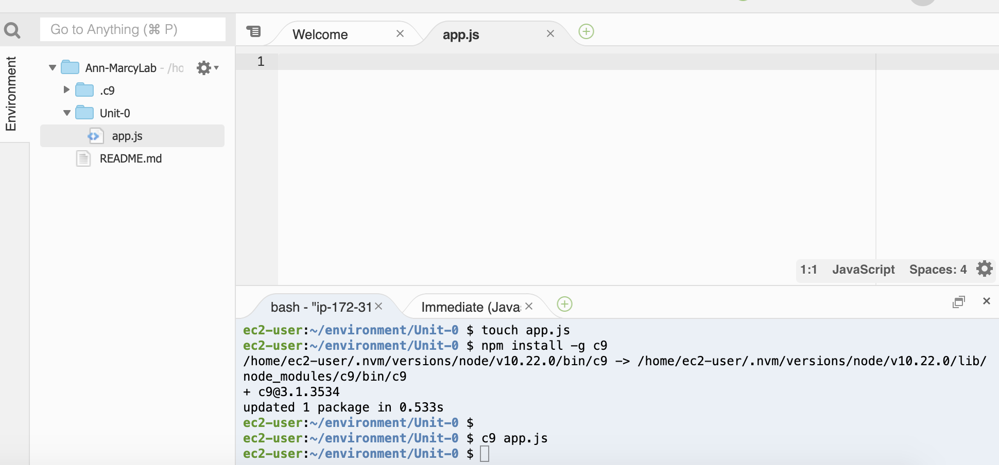
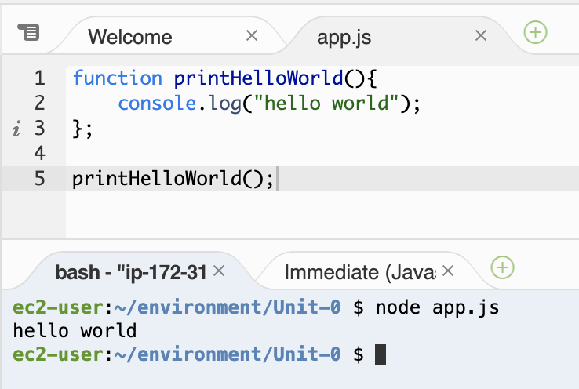
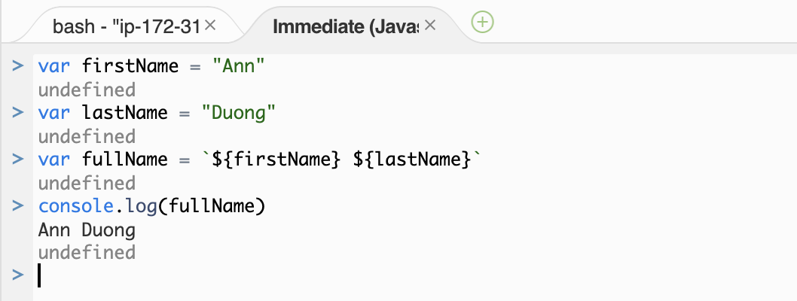
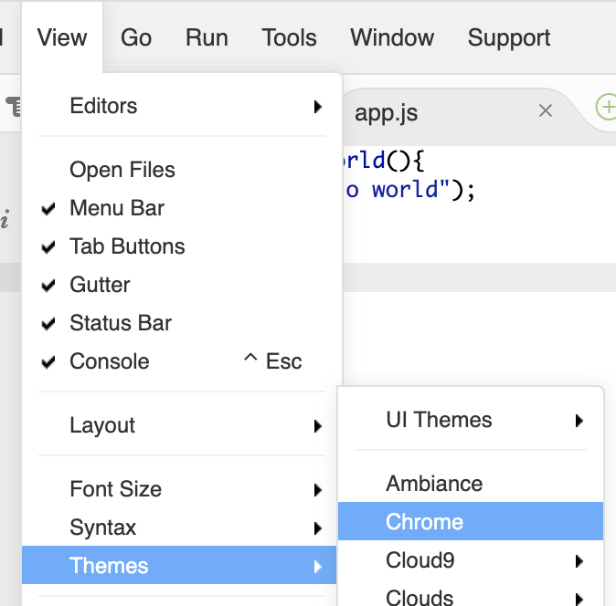

# Setting Up Our Development Environment

For your first months at Marcy Lab School, you will be developing using Amazon Web Service (AWS) Cloud9. It will give all fellows and instructors a standard and consistent coding environment. Once you gain more coding experience and begin to create robust web applications, you will transition to developing on your local machines. 

## Objectives
FWBAT...
* Set up their development environment on AWS EC2
* Understand how AWS fits in to larger cloud computing ecosystem

## Vocabulary
* Server
* Cloud Computing
* Virtual Machine
* IaaS - Infrastructure as a Service
* AWS - Amazon Web Services
  - AWS EC2
  - AWS Cloud9
* IDE - Integrated Development Environment
* Development Environment

## The Why?
### AWS and Cloud Computing
* We will be using AWS Cloud9 as our **development environment**.
* It's easy. It's cheap. It can be accessed from anywhere (as long as you have an internet connection). And it's more than enough to build a full stack application (and career!) on.
* Bonus: We get introduced to **cloud computing** the **AWS** ecosystem.
* Cloud Computing has fundamentally changed the way that we design, deploy, and use software.
* AWS is the global leader in **_cloud computing_** and it's not even close.
  * Microsoft, IBM, and Google are the closest competitor and AWS has more market share than all of them combined.
* Here's how Amazon define's cloud computing:
> Cloud computing is the on-demand delivery of compute power, database, storage, applications, and other IT resources via the internet with pay-as-you-go pricing.
> Whether you are using it to run applications that share photos to millions of mobile users or to support business critical operations, a cloud services platform provides rapid access to flexible and low cost IT resources. With cloud computing, you don’t need to make large upfront investments in hardware and spend a lot of time on the heavy lifting of managing that hardware. Instead, you can provision exactly the right type and size of computing resources you need to power your newest idea or operate your IT department. You can access as many resources as you need, almost instantly, and only pay for what you use.
* To unpack that, let's look at an example: Netflix
  - Netflix is built on AWS. What does a company like Netflix look like before/after cloud computing?
* To further illustrate, lets check out this video: [A Visit to the Cloud](https://youtu.be/94PO2-TL4Vs)

### Cloud9 and the AWS Ecosystem
* Cloud9 is "a cloud-based integrated development environment (IDE) that you use to write, run, and debug code".
  * An integrated development environment is an application that provides all the tools you need for software development in one location. They include a terminal, a text editor, and a graphical directory tree.
* Instead of running your code on your physical computer, Cloud9 creates a **_virtual machine_** for your code to run on.
* Virtual machines are AWS most popular product. They offer them through a service called **_EC2 or Elastic Cloud Compute_**.
* Cloud9 and EC2 are just two of **over 100 services** that AWS offers to allow you to buid software, secure it, and deploy it to the world.
* Their ecosystem is so large that they offer a suite of certifications that you can obtain to signal your experience to potential employers.

## Setting Up our Cloud9 Development Environment
1. Log into your AWS account.
2. Change your password.
3. Once logged in, under "Find Services", type in "Cloud9".
4. Once at the Cloud9 homepage, click 'Create Environment'
5. Create your Cloud9 environment.
  * **Step 1: Name Environment**
    Name: _firstName-marcylab_
    Description: This is the development environment for my Marcy Lab School projects and assignments.
  * **Step 2: Configure Settings**
    Leave all defaults as they are and click 'Next Step'
  * **Step 3: Review**
    Accept
6. Wait a minute while the environment configures. Once it's loaded, **save the link to your bookmarks**

## Touring the IDE
### Exploring the User Interface

On the left, the Environment is where you can see the directories and files in your Cloud9 environment. You can right click in this area to manually create new files and folders.

### Manipulating your directory tree using the integrated terminal

Although you can create files and folder using the left side bar, developers who use the Command Line can create files and folders very efficiently.

The first tab in your console is your terminal (command line interface). Type `pwd` and `ls` to see your working directory and view your files respectively. Since you'll be developing in this environment for a couple months, let's get organized. Create a folder called `Unit-0`, a place where you can save all your Unit 0 work.

### Creating and opening a file

`cd` into your new `Unit-0` folder and create a JavaScript file called app.js. Use the command `touch app.js`. Next, we are going to install some Cloud9 tools. Run `npm install -g c9` in the terminal. The npm install part of the command is installing a tool called c9, and the -g flag installs it globally on our Cloud9 environment.

You need to restart your workspace, and you can do so by **refreshing the page**. Now, you can type `c9 <filename>` to open any file from the terminal. The file will appear in the Cloud9 panel. Open your new file with the command `c9 app.js`.

### Running a JavaScript file

Now that you can edit files, create a JavaScript function that will `console.log` "hello world". Be sure to invoked that function in your `app.js` file. Save the file using Control-S or Command-S on your keyboard. Next, type `node app.js` to run the JavaScript file. Node is the tool developers use to run JavaScript. Ensure that the string "hello world" is printed to your terminal.

### Interacting with the built-in JavaScript console

Click on the second tab of your console where it says "Immediate". This tab can be used as a JavaScript console. Create variables `firstName` and `lastName` and see if you can `console.log` your full name. Follow the example below:

**Note:** Every time you press enter, the JavaScript code is executed as a block. So you'll need to declared variables with `var` if you want their scope to persist between when you press "Enter". In order to write multiple JS lines at once, hold down "Shift" as you press "Enter" for a new line.

### Additional Exploration

Take some time to explore other features of Cloud 9. You can even change the color theme of your environment.

